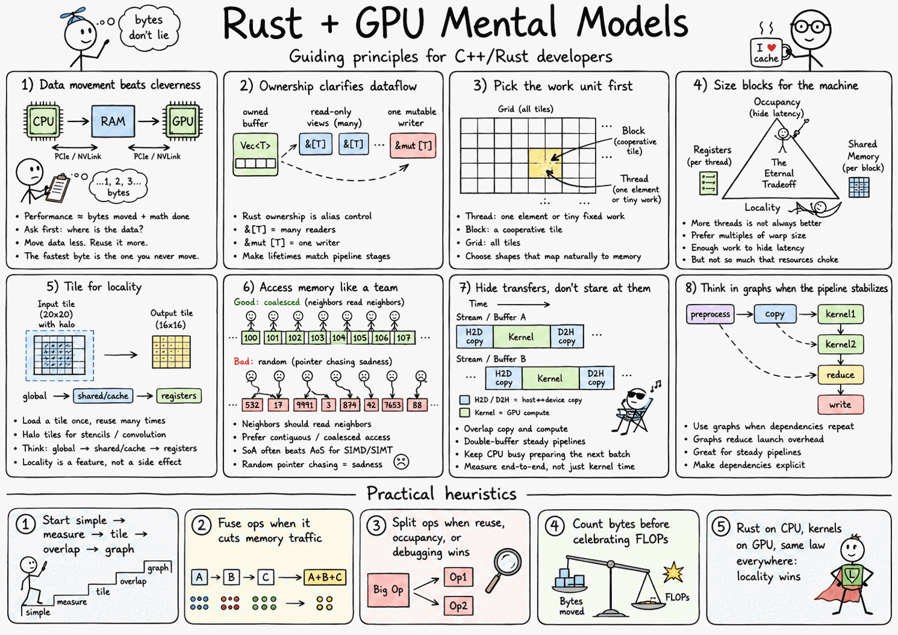
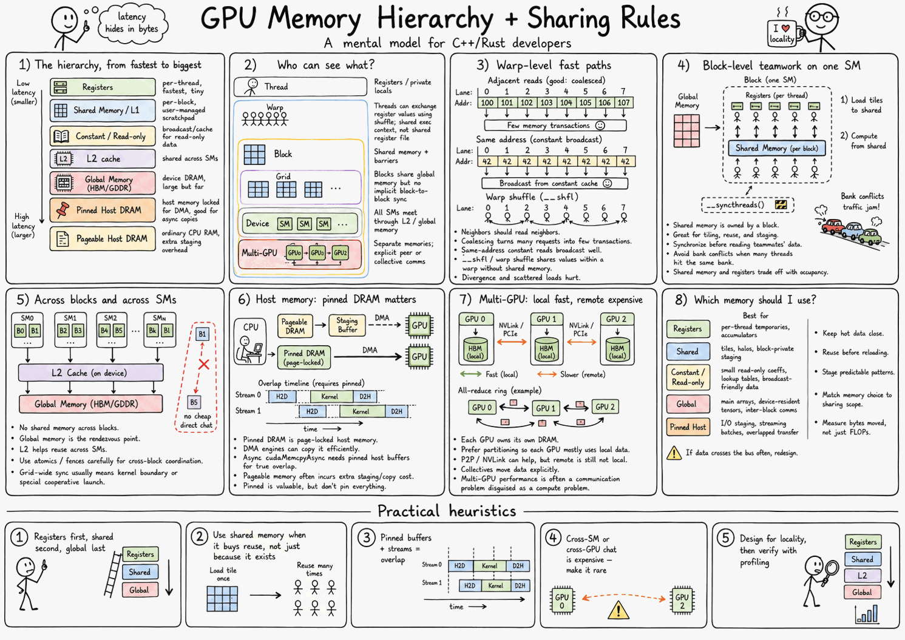

<p align="center">
  
</p>

# CUDA Dojo

A level-by-level CUDA learning project, structured as a skill tree rather than a
textbook. Each level unlocks one mental model and one production skill. Host code
is **C++23**, device code is **C++20** (the highest CUDA reliably supports for
`__device__` code today).

> **Hardware:** CUDA requires an NVIDIA GPU. macOS/Apple Silicon cannot build or
> run this — develop on a Linux/Windows box with the CUDA Toolkit installed.

## How to use this

CUDA Dojo is a hands-on **learning template**, not a library to depend on. The
intended loop is: get your own copy, work a level until you can *explain* it, then
climb the tree. The [interactive guide](https://bolu.dev/cuda-dojo/) teaches the
mental model; the `levels/` code is where you prove you have it.

1. **Get your own copy.** Click **Use this template** on GitHub (or fork) to start
   a personal repo you can commit your solutions into, then clone it:
   ```bash
   git clone https://github.com/<you>/cuda-dojo.git
   cd cuda-dojo
   make dep-check        # confirm your CUDA toolchain is ready
   ```
2. **Read the level, then the code.** Open the matching page in the
   [interactive guide](https://bolu.dev/cuda-dojo/) (or `make docs-serve` for a
   local copy), play with the widgets until the concept clicks, then read the
   kernels in `levels/levelNN_<topic>/`.
3. **Build and prove it.** `make levelNN-test` compiles the level and runs it
   against a CPU reference. A green test is the *floor*, not the goal — make sure
   you can predict the numbers (transactions, bandwidth, occupancy), not just pass.
4. **Extend, then continue.** Each level ends with "your reps" — small variations
   to implement yourself. Scaffold a new level with `add_dojo_level(...)` (see
   [Anatomy of a level](#anatomy-of-a-level)) and work up the
   [skill tree](#the-skill-tree).

## Build & test

The `Makefile` is the front door — it wraps CMake/CTest and auto-discovers levels
from `levels/`, so per-level targets appear automatically as levels are added.

```bash
make dep-check        # verify toolchain (nvcc, cmake, generator, profilers)
make                  # configure + build everything
make test             # run all level tests (CTest)

make level01          # build one level's kernel lib + demo
make level01-test     # build + run just that level's tests
make help             # list every target, including per-level ones
make clean            # remove ./build (distclean also drops ./out, ./.venv)
```

Prefer raw CMake? It works the same:

```bash
cmake -B build -G Ninja                        # configure (targets local GPU arch)
cmake --build build -j                          # build everything
ctest --test-dir build --output-on-failure      # run all tests
./build/levels/level01_vector_add/level01_demo   # run a level's demo
```

Pin specific architectures instead of autodetecting (required when building
without a GPU present, e.g. in CI or a container):

```bash
cmake -B build -DCMAKE_CUDA_ARCHITECTURES="80;86;90"   # or: all-major
```

## Docker (self-contained toolchain)

The image encapsulates the **entire CUDA toolkit** (nvcc, cuBLAS, cuFFT, …) plus
build deps — no host CUDA install needed. The one thing it can't contain is the
NVIDIA **kernel driver**: that stays on the host and is bridged in at runtime by
the [NVIDIA Container Toolkit](https://docs.nvidia.com/datacenter/cloud-native/container-toolkit/latest/install-guide.html)
(`--gpus all`). So *compiling* needs no GPU, but *running kernels* needs a GPU host.

```bash
make docker-build     # build the toolchain image
make docker-compile   # compile in-container WITHOUT a GPU (all-major) — CI/Mac friendly
make docker-test      # build + test in-container (needs a GPU host + --gpus all)
make docker-shell     # interactive shell, repo bind-mounted, --gpus all
```

VS Code users: **Reopen in Container** uses `.devcontainer/` (GPU optional, so it
opens and compiles even on machines without an NVIDIA GPU).

## Project layout

```
common/dojo/cuda_utils.cuh   CUDA_CHECK, GpuTimer, bandwidth/FLOP helpers, device info
common/dojo/test.hpp         zero-dependency micro test harness (CTest-backed)
cmake/Dojo.cmake             add_dojo_level() — one helper builds lib + demo + test
levels/levelNN_<topic>/      each level: kernels (.cu), a demo, and a test
```

### Anatomy of a level

Kernels live in a small static library that **both** the demo and the test link
against, so the canonical host+kernel code is written once and exercised two
ways. Add a new level by creating `levels/levelNN_<topic>/` with a
`CMakeLists.txt` calling `add_dojo_level(...)`, then `add_subdirectory(...)` it
from the top-level `CMakeLists.txt`.

## The skill tree

| Level | Project | Core concepts | Status |
|------:|---------|---------------|:------:|
| 1 | Vector add / SAXPY / reduction | thread indexing, launches, `cudaMalloc`/`Memcpy`, error checking | ✅ |
| 2 | Image invert / threshold | 2D grids, thread→pixel mapping, boundary conditions | ✅ |
| 3 | Matrix transpose | coalescing | ✅ |
| 4 | Tiled transpose | shared memory, bank conflicts | ✅ |
| 5 | Box filter / separable blur | halo loading, `__syncthreads()` | ✅ |
| 6 | Reduction / histogram (warp) | `__shfl_sync`, warp primitives | ✅ |
| 7 | Histogram | atomics, privatization | ⬜ |
| 8 | Prefix scan | cooperative algorithms | ⬜ |
| 9 | GEMM | tiling, register blocking | ⬜ |
| 10 | FFT | multi-stage, cuFFT integration | ⬜ |
| 11 | Video pipeline | streams, overlap, CUDA Graphs, orchestration patterns | ⬜ |
| 12 | End-to-end image pipeline | production architecture | ⬜ |

Given an HPC/SIMD/OpenMP background, levels 1–2 should go fast; the real payoff
is levels 4–10 (memory hierarchy, warp programming, Nsight-driven perf analysis,
and stream/graph pipelines).

The docs also include three advanced tracks that stay in the same Feynman style:
architecture (now also covering multi-GPU scaling — NCCL/NVSHMEM, MIG), libraries,
and imaging/CV. Each one is built around prediction, interactive widgets, and concrete
CUDA reps rather than reference-manual lists.

## Profiling (from Level 5 onward)

Release builds compile with `-lineinfo` so the profilers map SASS back to source:

```bash
nsys profile ./build/levels/.../levelNN_demo     # timeline: transfers, kernels, gaps
ncu --set full ./build/levels/.../levelNN_demo    # per-kernel: occupancy, memory, roofline
```

## Interactive guide (docs)

A Feynman-style, level-by-level companion site with **interactive canvas widgets**
(thread indexing, SIMT divergence, coalescing, roofline, reduction, streams …)
lives in `docs/`, built with MkDocs Material.

```bash
make docs-serve       # live preview at http://127.0.0.1:9090
make docs             # build static site into ./out/docs
```

## Cheatsheets

To help with learning CUDA concepts (these are designed to be printed on standard Letter-sized paper):




## License

BSD 3-Clause. Redistribution must retain the copyright notice, license terms,
and disclaimer; see [LICENSE](LICENSE).
